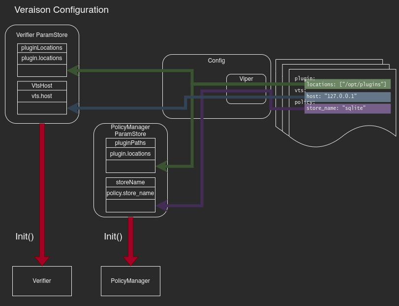
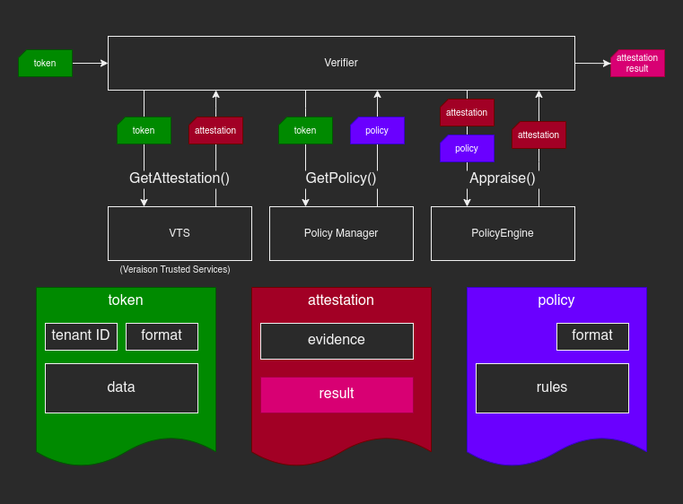
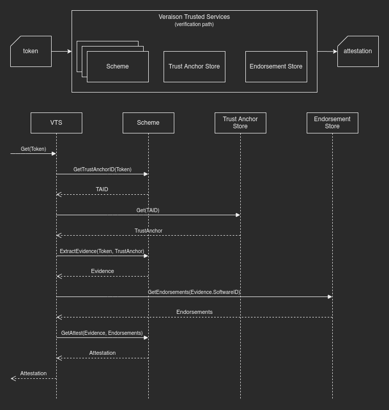

# Verifier Refactor Changes Overview

## Configuration

Configuration for each Veraison component is encapsulated by a `ParamStore`
that contains parameter definitions. A parameter definition specifies the type
of the parameter (used in validation), and a path where it can be found within
configuration.

Configuration for a Veraison deployment is handled by a `Config` that gathers
`ParamStore`s for components used in that deployment. The `Config`uses
[Viper](https://github.com/spf13/viper) to gather configuration from various
sources and populate `ParamStore`s associated with it. Parameters are populated
based on their paths,  and the same value can be used to populate parameters
inside multiple stores, if they share a path.

  

`ParamStore`s are created and initialized with parameter definitions for their
respective component. Most components will have associated helper functions to
do that. The `ParamStore`s are then passed onto the `Config` that assumes
ownership of them, and populates them with values read from external sources.
The values are validated against the definitions. This happens on deployment
start. Once the `Config` finishes processing external sources, deployment
initialization proceeds by initializing the individual components. The
`ParamStore`s are passed to the components' `Init()` methods, whereupon the
`Config` relinquishes ownership over them (i.e. they would no longer be
updated). The values in the stores are used by the `Init()` methods to
initialize the components. `ParamStore`s are not used beyond that.

There is currently no provision for continuous monitoring of external sources
and dynamic update mid-execution.

## Verifier

The Verifier receives an attestation token and returns an attestation result
indicating whether that token is well structured and has been verified against
provisioned endorsements. Most of the heavy lifting is performed by the
Veraison Trusted Services (VTS) component. It can be executed within the same
process as the verifier (for integrated deployment) or in a separate process
(and possibly, on a separate node), in order to isolate high-trust services.

VTS verifies the token against the trust anchor, extracts the evidence, fetches
associated endorsements, and initializes an attestation result, populating the
Trust Vector by appraising the evidence against the endorsements in an
attestation scheme specific manner.

The resulting attestation is returned to the verifier. If a policy has been
registered as part of the attestation scheme, the verifier will  apply it to
the attestation, allowing for the Trust Vector to be updated in a custom
manner.

  

## VTS

Veraison Trusted Services (in the context of verification) consist of

- Schemes that encapsulate the knowledge of how a particular token should be
  parsed in order to extract evidence, how the token may be validated against a
  trust anchor, and how evidence should be evaluated against endorsements in
  order to populate the Trust Vector.
- A trust anchor store that maintains provisioned trust anchors (such as keys
  and certificates) used to validate received tokens.
- An endorsement store that maintains endorsements provisioned from the supply
  chain (OEM, ISV, etc). Endorsements may be "golden values" against which
  claims from the evidences can be verified, or additional claims that are
  associated with, but are not part of the token (e.g. certification
  information).

On the verification path, VTS interface exposes a single method that processes
the token and returns an attestation result with the associated evidence and
endorsements.

  

