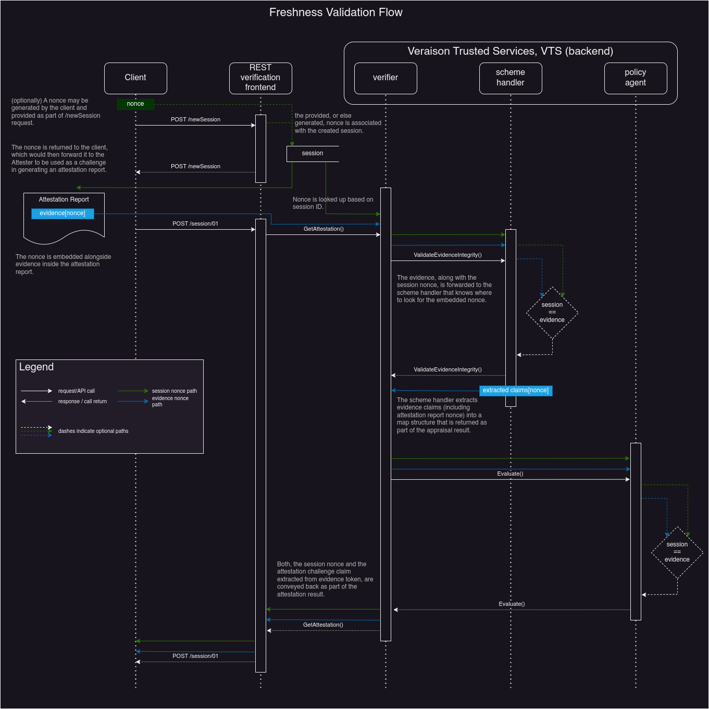

## Freshness

In order to prevent replay attacks, Veraison employs a two-stage
challenge-response protocol for verification. First, a verification session is
created, and a nonce for that session is established. The nonce is used as a
challenge when generating the attestation report/token which is presented in
the second stage that results in a signed attestation result produced by the
verifier.

Since the way the nonce is incorporated in the attestation token depends on
the specifics of the attestation scheme, the core Veraison verifier only
propagates the session nonce (established in the first stage), along with the
evidence extracted from the attestation token. There are three options for
how/where token freshness can be validated:

1. by the attestation scheme's Evidence Handler plugin
2. by the deployment-specific policy associated with the scheme
3. left to the Relying Party to verify based on the attestation result (which
   includes both the session nonce and the extracted evidence)

The following diagram shows the (simplified) verification flow,
illustrating how the nonce travels through it and how it may be used to ensure
freshness.

1. Verification is initiated by the client (the Attester or the Relying Party,
   depending on the [interaction
   model](https://www.rfc-editor.org/rfc/rfc9334.html#name-topological-patterns)
   used) with a new session request. The client can optionally specify the
   nonce to be used for this verification session, or the size of the nonce to
   be generated by Veraison. Either way, the nonce is limited to be between 8
   and 64 bytes long (see [EAT `eat_nonce`
   claim](https://www.ietf.org/archive/id/draft-ietf-rats-eat-21.html#name-eat_nonce-eat-nonce-claim)).
2. The nonce (whether provided or generated) is associated with the created
   session, and is returned in the response to the new session request.
3. (The assumption is that) the returned nonce is then used as the challenge to
   the attester when generating the attestation token.
4. The attestation token/evidence (that embeds the nonce/challenge) is then
   submitted to the session URL for verification.
5. The verification frontend retrieves the nonce it has associated with the
   session and sends it along with the received attestation token to the
   verifier on the VTS backend via a `IVTSClient.GetAttestation()` call.
6. The VTS verifier uses media type information associated with the attestation token
   to retrieve an appropriate handler from the loaded plugins, and uses that
   handler to process the evidence.
7. That includes invoking `IEvidenceHandler.ValidateEvidenceIntegrity()`, which
   is a scheme-specific handler implementation intended to provide
   means to ensure the received evidence is valid. This is the place at
   which handler implementations (i.e. scheme plugins) MAY check that the
   session nonce associated with the token matches the challenge decoded from
   the token's evidence claims.
8. Once the scheme-specific processing of attestation evidence is complete, the
   results are passed to the policy agent via a call to `IAgent.Evaluate()`. This
   allows policies an opportunity to override the results generated by the
   scheme handler, including downgrading result status if the session nonce
   does not match the challenge inside the evidence.
9. Finally, the attestation result is signed and returned to the client. The
   session nonce and the extracted evidence are part of the result, allowing
   for the final opportunity to confirm freshness by the receiver.

### Checking via scheme handler

Freshness can be verified inside `IEvidenceHandler.ValidateEvidenceIntegrity()`
implementation. This receives a `proto.AttestationToken` as an argument. The
session nonce is contained within `token.Nonce` field, and the `token.Evidence`
field contains the raw bytes of the evidence set by the client. See
[PSA_IOT](https://github.com/veraison/services/blob/56e0388d/scheme/psa-iot/evidence_handler.go#L78)
scheme implementation for an example.

If the attestation scheme mandates how freshness challenges are to be handled,
this is the preferred way of  implementing freshness checks in Veraison.

### Checking via OPA policy

OPA is currently the only policy agent implementation in Veraison. Policies are
written using [Rego policy
language](https://www.openpolicyagent.org/docs/latest/policy-language/). When
the policy runs, the `policy` package is pre-populated with the appropriate
inputs. The evidence extracted by the scheme is stored within the `evidence`
object. The nonce can be obtained from the `session` object (as
`session["nonce"]` or `session.nonce`). See [this
policy](https://github.com/veraison/services/blob/main/integration-tests/data/policies/cca-verify-challenge.rego)
inside integration tests for an example of verifying the challenge inside
CCA_SSD_PLATFORM evidence.

### Checking by the Relying Party

Finally, the Relying Party may check the evidence freshness by itself. The
attestation result returned by Veraison is in
[EAT](https://www.ietf.org/archive/id/draft-fv-rats-ear-01.html) format. Within
this result, the session nonce is contained inside `eat_nonce` claim, and the
evidence extracted by Veraison is inside `ear.veraison.annotated-evidence`
extension claim. Veraison provides libraries in
[Go](https://github.com/veraison/ear/),
[Rust](https://github.com/veraison/rust-ear), and
[C](https://github.com/veraison/c-earhttps://github.com/veraison/c-ear) for
working with EAT attestation results.
