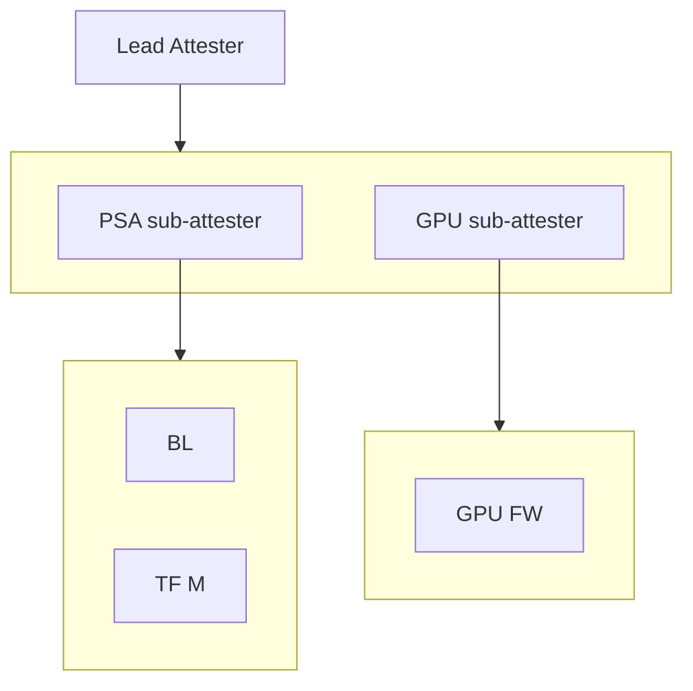
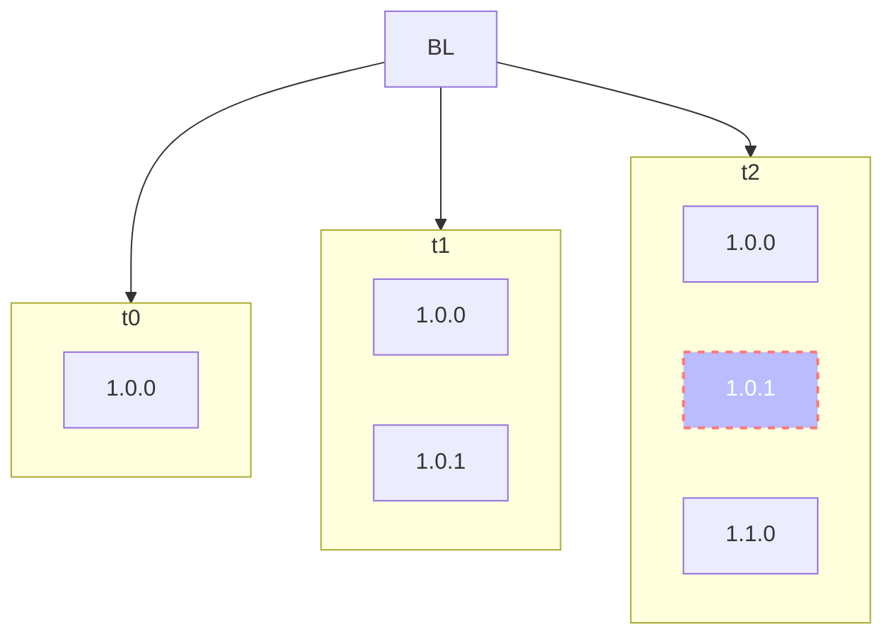

# Composite Attester Description

We model a composite device with a lead attester and two sub-attesters.

Each sub-attester produces signed evidence about itself that is collected by the lead attester, wrapped and re-signed.

We model a FW life-cycle management scenario for one of the sub-attesters, comprising FW update and security incident.



## Filling the Gaps

In order to model recursive composition, the `domain-membership-triple-record` is extended as follows:

```cddl
domain-membership-triple-record = [
    name: $domain-type-choice / environment-map
    TEs: [ + environment-map ]
]
```

A domain describes an attester as the collection of its target environments.
The domain has a _name_ which is either an environment or a plain identifier.
The latter form can be used if the domain is not expected to be found in triples.

### X-Triples

To model revocation of previously provisioned reference values, the `x-reference-triple-record` is introduced with the following syntax:

```cddl
reference-triple-record = [
  environment-map
  measurement-map
  $refval-x-reason
]
 
$refval-x-reason /= obsolete
$refval-x-reason /= insecure
; other reasons
```

## Base Composition

### PSA RoT Initial Reference Values

The PSA sub-attester has two firmware components: boot-loader and secure partition manager.
Each component is assigned a unique identifier that is guaranteed to remain stable for the lifetime of the component -- i.e., it will not change across FW updates, security related events, etc.
Their reference values are initially configured with the following reference-value triples:

* boot-loader (`BL`), version 1.0.0:

```cbor-diag
[
    / environment-map / {
        / comid.class / 0 : {
            / comid.class-id / 0 : 37(h'57057d658db1403b9e387f9f0fa604cf'),
            / comid.vendor /   1 : "FW Manufacturer X",
            / comid.model /    2 : "BL"
        }
    },

    / measurement-map / {
        / comid.mval / 1 : {
            / comid.version / 0 : {
                / version / 0: "1.0.0"
            },
            / comid.digests / 2 : [
                [
                    / hash-alg-id / 1, / sha256 /
                    / hash-value /  h'44aa336af4cb14a879432e53dd6571c7fa9bccafb75f488259262d6ea3a4d91b'
                ]
            ]
        }
    },
],
```

* secure partition manager (`TF-M`), version 1.0.0:

```cbor-diag
[
    / environment-map / {
        / comid.class / 0 : {
            / comid.class-id / 0 : 37(h'993a383a41134c999c333a13414a546d'),
            / comid.vendor /   1 : "FW Manufacturer X",
            / comid.model /    2 : "TF-M"
        }
    },
    / measurement-map / {
        / comid.mval / 1 : {
            / comid.version / 0 : {
                /version / 0: "1.0.0"
            },
            / comid.digests / 2 : [
                [
                    / hash-alg-id / 1, / sha256 /
                    / hash-value /  h'9c49c3f7b15f62db77deb9a5fa5a21e516edb15bb7b2214654695a59ac492d9e'
                ]
            ]
        }
    }
]
```

### PSA RoT Domain Composition

The PSA sub-attester is modelled using a domain membership triple.
The _name_ of the domain is given as an environment with `class-id` set to the _PSA Implementation ID_ of the sub-attester.
Naming the domain using the environment form allows recursive composition.
The domain elements are the target environments associated with the FW components (i.e., `BL` and `TF-M`).

```cbor-diag
[
    / environment-map / {
        / comid.class / 0 : {
            / comid.class-id / 0 : / tagged-impl-id-type / 600(
                h'61636d652d696d706c656d656e746174696f6e2d69642d303030303030303031'
            ),
            / comid.vendor / 1 : "ACME Ltd.",
            / comid.model /  2 : "PSA RoT 1.0"
        }
    },

    [
        / environment-map / {
            / comid.class / 0 : {
                / comid.class-id / 0 : 37(h'57057d658db1403b9e387f9f0fa604cf'),
                / comid.vendor /   1 : "FW Manufacturer X",
                / comid.model /    2 : "BL"
            }
        },
        / environment-map / {
            / comid.class / 0 : {
                / comid.class-id / 0 : 37(h'993a383a41134c999c333a13414a546d'),
                / comid.vendor /   1 : "FW Manufacturer X",
                / comid.model /    2 : "TF-M"
            }
        }
    ]
]
```

### PSA RoT Verification Key Material

Each raw public key (RPK) associated to a PSA device is individually provisioned in to the verifier.
For each RPK, we use an attestation key triple.
The subject is an environment with its own `instance-id`, and `class-id` equal to the PSA domain's `class-id`.
Note that the linkage between the PSA domain and each PSA instance is implicit in the environment's hierarchical naming scheme.

```
[
    / environment-map / {
        / comid.class / 0 : {
            / comid.class-id / 0 : / tagged-impl-id-type / 600(
                h'61636d652d696d706c656d656e746174696f6e2d69642d303030303030303031'
            ),
            / comid.vendor / 1 : "ACME Ltd.",
            / comid.model /  2 : "PSA RoT 1.0"
        },
        / comid.instance / 1 : / tagged-ueid-type / 550(
            h'014ca3e4f50bf248c39787020d68ffd05c88767751bf2645ca923f57a98becd296'
        )
    },

    [
        / tagged-pkix-base64-key-type /
        #6.554("MFkwEwYHKoZIzj0CAQYIKoZIzj0DAQcDQgAETl4iCZ47zrRbRG0TVf0dw7VFlHtv18HInYhnmMNybo+A1wuECyVqrDSmLt4QQzZPBECV8ANHS5HgGCCSr7E/Lg==")
    ]
],
[
    / ... another RPK /
]
```

### GPU Attester Initial Reference Values

The GPU sub-attester has one firmware component (`GPU-FW`).
Its reference values are initially configured with the following reference-value triple:

```cbor-diag
[
    / environment-map / {
        / comid.class / 0 : {
            / comid.class-id / 0 : / 37(h'0b27f2c351a04b338368d25f9021c1c2'),
            / comid.vendor /   1 : "GPU Manufacturer X",
            / comid.model /    2 : "GPU-FW"
        }
    },

    / measurement-map / {
        / comid.mval / 1 : {
            / comid.version / 0 : {
                / version / 0: "1.0.0"
            },
            / comid.digests / 2 : [
                [
                    / hash-alg-id / 1, / sha256 /
                    / hash-value /  h'34b03909f183581749721835ea2473e9377647da3cf7c7169b9b78e77ec260a2'
                ]
            ]
        }
    },
]
```

### GPU Domain Composition

Similar to the PSA sub-attester, the GPU sub-attester is modelled using a domain membership triple.
The _name_ of the domain is given as an environment with `class-id` set to the unique identifier for the GPU model.
The domain element is the target environment associated with the FW component (i.e., `GPU-FW`).

```cbor-diag
[
    / environment-map / {
        / comid.class / 0 : {
            / comid.class-id / 0 : 37(h'c77b8c870b4a44058b024e5388ffd8e6'),
            / comid.vendor / 1 : "GPUs Inc.",
            / comid.model /  2 : "Fancy 2.0"
        }
    },

    [
        / environment-map / {
            / comid.class / 0 : {
                / comid.class-id / 0 : / 37(h'0b27f2c351a04b338368d25f9021c1c2'),
                / comid.vendor /   1 : "GPU Manufacturer X",
                / comid.model /    2 : "GPU-FW"
            }
        }
    ]
]
```

### GPU Verification Key Material

Each GPU has its own key-pair certified by the GPU vendor's CA.
The CA certificate chain is provided in an attestation key triple.
The subject is the GPU domain name environment.

```cbor-diag
[
    / environment-map / {
        / comid.class / 0 : {
            / comid.class-id / 0 : 37(h'c77b8c870b4a44058b024e5388ffd8e6'),
            / comid.vendor / 1 : "GPUs Inc.",
            / comid.model /  2 : "Fancy 2.0"
        }
    },

    / root & intermediate CAs certs / [
        #6.555("MIICYzCCAcygAwIBAgIBADANBgkq..."),
        #6.555("MIIF2zCCBMOgAwIBAgIQMj8Hjgwe..."),
    ]
]
```

### Lead Attester Composition

The lead attester aggregates the two sub-attesters (PSA and GPU) via their domain "names" (i.e., environments).

For simplicity, there are no reference values associated with the lead attester.

```cbor-diag
[
    / environment-map / {
        / comid.class / 0 : {
            / comid.class-id / 0 : 37(h'4304ada1ea71408dbafb27b4310f1181'),
            / comid.vendor / 1 : "Capi Attestatori SpA",
            / comid.model /  2 : "Lead Attester 1.0"
        }
    },

    [
        / PSA / {
            / comid.class / 0 : {
                / comid.class-id / 0 : / tagged-impl-id-type / 600(
                    h'61636d652d696d706c656d656e746174696f6e2d69642d303030303030303031'
                ),
                / comid.vendor / 1 : "ACME Ltd.",
                / comid.model /  2 : "PSA RoT 1.0"
            }
        },
        / GPU / {
            / comid.class / 0 : {
                / comid.class-id / 0 : 37(h'c77b8c870b4a44058b024e5388ffd8e6'),
                / comid.vendor / 1 : "GPUs Inc.",
                / comid.model /  2 : "Fancy 2.0"
            }
        }
    ]
]
```

```

### Lead Attester Key Material

Similar to the GPU arrangement, the lead attester has its own key-pair certified by the lead attester vendor's CA.
The CA certificate chain is provided in an attestation key triple.
The subject is the lead attester domain name environment.

```cbor-diag
[
    / environment-map / {
        / comid.class / 0 : {
            / comid.class-id / 0 : 37(h'c77b8c870b4a44058b024e5388ffd8e6'),
            / comid.vendor / 1 : "GPUs Inc.",
            / comid.model /  2 : "Fancy 2.0"
        }
    },

    / root & intermediate CAs certs / [
        #6.555("MIIKcQIBAzCCCi0GCSqGSIb3DQEH..."),
        #6.555("MIIB0TCCATqgAwIBAgIQUq+2SdEk...")
    ]
]
```

## Update Flow

_TODO set the context_

### SW Update for PSA RoT



BL gets updated to a new version 1.0.1 using the triple semantics below:

```
    / comid.reference-triples / 0 : [
        [
            / environment-map / {
            / comid.class / 0 : {
                / comid.class-id / 0 :
                / tagged-uuid-type / 37(
                    h'67b28b6c34cc40a19117ab5b05911e37'
                ),
                / comid.vendor / 1 : "FW Manufacture X",
                / comid.model / 2 : "BL",
                / comid.layer / 3 : 0
            }
            },
            / measurement-map / {
            / comid.mval / 1 : {
                / comid.version / 0 : {
                    /version / 0: "1.0.1"
                },
                / comid.digests / 2 : [ [
                / hash-alg-id / 1, / sha256 /
                / hash-value / h'YYZaa336af4cb14a879432e53dd6571c7fa9bccafb75f488259262d6ea3a4d91b'
                ] ]
            }
            }
        ]
```

### SW Update for GPU

GPU Component gets updated. A new version 1.2.0 of GPU FW is updated in the system

```
    / comid.reference-triples / 0 : [
        [
            / environment-map / {
            / comid.class / 0 : {
                / comid.class-id / 0 :
                / tagged-uuid-type / 37(
                    h'98b28b6c34cc40a19117ab5b05911e37'
                ),
                / comid.vendor / 1 : "GPU Manufacture X",
                / comid.model / 2 : "GPU-FW",
                / comid.layer / 3 : 0
            }
            },
            / measurement-map / {
            / comid.mval / 1 : {
                / comid.version / 0 : {
                    /version / 0: "1.2.0"
                },
                / comid.digests / 2 : [ [
                / hash-alg-id / 1, / sha256 /
                / hash-value / h'ABCD336af4cb14a879432e53dd6571c7fa9bccafb75f488259262d6ea3a4d91b'
                ] ]
            }
            }
    ],
]
```

## Impact to other triples

* We believe none of the Domain Composition or Domain Dependency triples need an update
as the Target Environments do not change.
