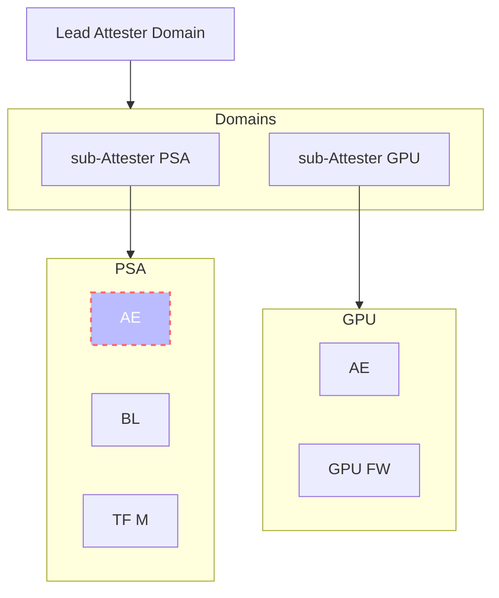

# Composite Attester Description

*This document explains for a composite attester built on PSA Root of Trust and a GPU subsystem can model supply chain Reference values and Endorsed Values. It also includes a scenario where these values get updated in the system.*



## Gap filling

The following extends the `domain-membership-triple-record` to model recursive composition:

```cddl
domain-membership-triple-record = [
    $domain-type-choice / environment-map
    [ + environment-map ]
]
```

## Base Composition

### Reference Triples for PSA RoT

* Boot-loader firmware:

```cbor-diag
[
    / environment-map / {
    / comid.class / 0 : {
        / comid.class-id / 0 : 37(h'57057d658db1403b9e387f9f0fa604cf'),
        / comid.vendor /   1 : "FW Manufacturer X",
        / comid.model /    2 : "BL"
    },

    / measurement-map / {
    / comid.mval / 1 : {
        / comid.version / 0 : {
            /version / 0: "1.0.0"
        },
        / comid.digests / 2 : [
            [
                / hash-alg-id / 1, / sha256 /
                / hash-value /  h'44aa336af4cb14a879432e53dd6571c7fa9bccafb75f488259262d6ea3a4d91b'
            ]
        ]
    }
],
```

* Secure Partition Manager firmware:

```cbor-diag
[
    / environment-map / {
        / comid.class / 0 : {
            / comid.class-id / 0 : 37(h'993a383a41134c999c333a13414a546d'),
            / comid.vendor /   1 : "FW Manufacturer X",
            / comid.model /    2 : "TF-M"
        }
    },
    / measurement-map / {
        / comid.mval / 1 : {
            / comid.version / 0 : {
                /version / 0: "1.0.0"
            },
            / comid.digests / 2 : [
                [
                    / hash-alg-id / 1, / sha256 /
                    / hash-value /  h'9c49c3f7b15f62db77deb9a5fa5a21e516edb15bb7b2214654695a59ac492d9e'
                ]
            ]
        }
    }
]
```

### Domain composition for PSA RoT

The PSA sub-attester is modelled as a domain membership triple.
The name of the domain is given as an environment with `class-id` set to the PSA Implementation ID of the sub-attester.
The domain elements are the target environments associated with the FW components.

```
[
    / name (as environment) /
    [
        / comid.class-id / 0 : / tagged-impl-id-type / 600(
            h'61636d652d696d706c656d656e746174696f6e2d69642d303030303030303031'
        ),
        / comid.vendor / 1 : "ACME Ltd.",
        / comid.model /  2 : "PSA RoT 1.0"
    ],

    [
        / environment-map / {
            / comid.class / 0 : {
                / comid.class-id / 0 : 37(h'57057d658db1403b9e387f9f0fa604cf'),
                / comid.vendor /   1 : "FW Manufacturer X",
                / comid.model /    2 : "BL"
            }
        },
        / environment-map / {
            / comid.class / 0 : {
                / comid.class-id / 0 : 37(h'68b28b6c34cc40a19117ab5b05911e37'),
                / comid.vendor /   1 : "FW Manufacturer X",
                / comid.model /    2 : "TF-M"
            }
        }
    ]
]
```

### Verification Key Material

Each raw public key (RPK) associated to a PSA device is individually provisioned in to the verifier.
For each RPK, we usa a "Verification Key Material" triple.
The subject is an environment with its own `instance-id`, and `class-id` equal to the PSA domain's `class-id`.
Note that the linkage between the PSA domain and each PSA instance is implicit in the hierarchical naming scheme.

```
       / comid.attest-key-triples / 3 : [
         [
           / environment-map / {
             / comid.class / 0 : {
               / comid.class-id / 0 :
                 / tagged-impl-id-type / 600(
                   h'61636d652d696d706c656d656e746174
                     696f6e2d69642d303030303030303031'
                 ),
                 / comid.vendor / 1 : "ACME Ltd.",
                 / comid.model /  2 : "PSA RoT 1.0"
             },
             / comid.instance / 1 :
               / tagged-ueid-type / 550(
                 h'01
                   4ca3e4f50bf248c39787020d68ffd05c
                   88767751bf2645ca923f57a98becd296'
               )
           },
           [
             / verification-key-map / {
               / comid.key / 0 :
                 "MFkwEwYHKoZIzj0CAQYIKoZIzj0DAQcDQgA
   ETl4iCZ47zrRbRG0TVf0dw7VFlHtv18HInY
   hnmMNybo+A1wuECyVqrDSmLt4QQzZPBECV8
   ANHS5HgGCCSr7E/Lg=="
             }
           ]
         ]
```

### GPU Attester Reference Values

```
    / comid.reference-triples / 0 : [
        [
            / environment-map / {
              / comid.class / 0 : {
                / comid.class-id / 0 :
                / tagged-uuid-type / 37(
                    h'98b28b6c34cc40a19117ab5b05911e37'
                ),
                / comid.vendor / 1 : "GPU Manufacture X",
                / comid.model / 2 : "GPU-FW"
            },
            / measurement-map / {
              / comid.mval / 1 : {
                / comid.version / 0 : {
                    / version / 0: "1.0.0"
                },
                / comid.digests / 2 : [ [
                  / hash-alg-id / 1, / sha256 /
                  / hash-value / h'94aa336af4cb14a879432e53dd6571c7fa9bccafb75f488259262d6ea3a4d91b'
                ] ]
            }
        }
    ],
]
```

### Domain definition for GPU

Note this may be strictly not required as GPU Domain has
only one environment but documented here for completeness

```
    / comid.membership-triples / 5 : [
    {
        / domain.env / 0: {
            / comid.class-id / 0 :
                / tagged-impl-id-type / TBD(
                h'57b28b6c34cc40a19117ab5b05911e37'
                ),
            /comid.vendor / 1 : "ARM"
        },
        [
            / environment-map / {
            / comid.class / 0 : {
                / comid.class-id / 0 :
                / tagged-uuid-type / 37(
                    h'98b28b6c34cc40a19117ab5b05911e37'
                ),
                / comid.vendor / 1 : "GPU Manufacture X",
                / comid.model / 2 : "GPU-FW",
                / comid.layer / 3 : 0
            }
            },
        ]

    }
    ]
```

### Domain Dependency Triple

* Subject: Device Domain Identifier
* Object : [PSA-Domain, GPU-Domain]

```
    / comid.dependency-triples / 4 : [
    {
        / domain.env / 0: {
            / comid.class-id / 0 :
                / tagged-uuid-type / 37 (
                h'dcbfedf1234567890'
                ),
            /comid.vendor / 1 : "XYZ Composite Device"
        },
        [
            / environment-map / {
             / comid.class-id / 0 :
                / tagged-impl-id-type / TBD(
                h'67b28b6c34cc40a19117ab5b05911e37' ; ; This is PSA Domain
                ),
            /comid.vendor / 1 : "ARM"
            },
            / environment-map / {
             / comid.class-id / 0 :
                / tagged-impl-id-type / TBD(
                h'57b28b6c34cc40a19117ab5b05911e37' ; This is GPU Domain
                ),
            /comid.vendor / 1 : "ARM"
            },
        ]

    }
    ]
```

## UPDATE Flow

This section describes the CDDL Schema when there is an update to
Composite Attester components, namely PSA RoT and GPU sub-attester.

### SW Update for PSA RoT

BL gets updated to a new version 1.0.1 using the triple semantics below:

```
    / comid.reference-triples / 0 : [
        [
            / environment-map / {
            / comid.class / 0 : {
                / comid.class-id / 0 :
                / tagged-uuid-type / 37(
                    h'67b28b6c34cc40a19117ab5b05911e37'
                ),
                / comid.vendor / 1 : "FW Manufacture X",
                / comid.model / 2 : "BL",
                / comid.layer / 3 : 0
            }
            },
            / measurement-map / {
            / comid.mval / 1 : {
                / comid.version / 0 : {
                    /version / 0: "1.0.1"
                },
                / comid.digests / 2 : [ [
                / hash-alg-id / 1, / sha256 /
                / hash-value / h'YYZaa336af4cb14a879432e53dd6571c7fa9bccafb75f488259262d6ea3a4d91b'
                ] ]
            }
            }
        ]
```

### SW Update for GPU

GPU Component gets updated. A new version 1.2.0 of GPU FW is updated in the system

```
    / comid.reference-triples / 0 : [
        [
            / environment-map / {
            / comid.class / 0 : {
                / comid.class-id / 0 :
                / tagged-uuid-type / 37(
                    h'98b28b6c34cc40a19117ab5b05911e37'
                ),
                / comid.vendor / 1 : "GPU Manufacture X",
                / comid.model / 2 : "GPU-FW",
                / comid.layer / 3 : 0
            }
            },
            / measurement-map / {
            / comid.mval / 1 : {
                / comid.version / 0 : {
                    /version / 0: "1.2.0"
                },
                / comid.digests / 2 : [ [
                / hash-alg-id / 1, / sha256 /
                / hash-value / h'ABCD336af4cb14a879432e53dd6571c7fa9bccafb75f488259262d6ea3a4d91b'
                ] ]
            }
            }
    ],
]
```

## Impact to other triples

* We believe none of the Domain Composition or Domain Dependency triples need an update
as the Target Environments do not change.
