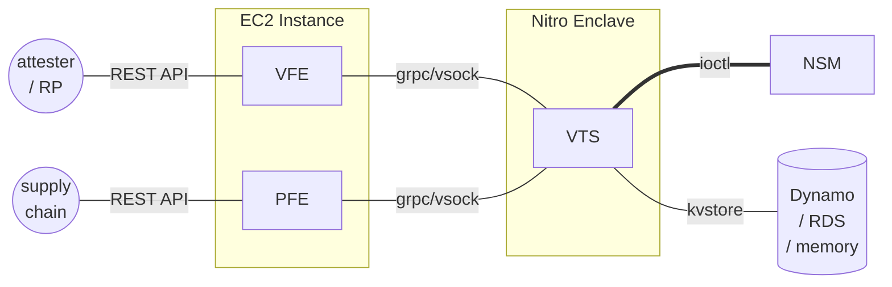
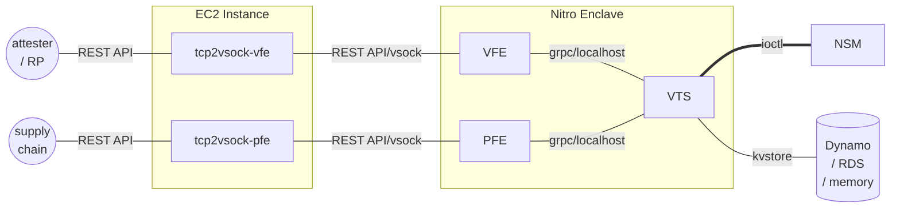
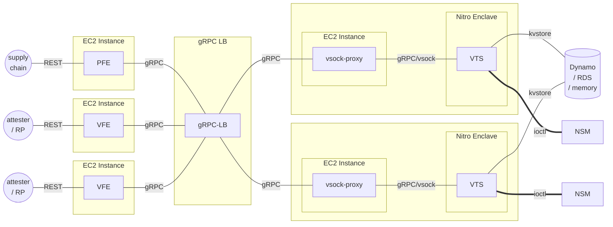

# Deploy with TEEs

## AWS Nitro prototype

* An "all-in-one-node" architecture, i.e., the scaling unit is the services conglomerate
* The intended split is:
  * TCB in _confidential_ VM (Nitro)
  * Non-TCB _normal_ VM (EC2)

### Observations

* Problem: the TCB _currently_ leaks into PFE: we need to move the whole CoRIM processor (both crypto verification and endorsements extraction) into VTS
  * Also, the tenant's bearer token presented to PFE MUST be bound to the CoRIM signer's key
* When generating the EAR signing key-pair on the fly (rather than pre-provisioning), the caching strategy that uses `.well-known/veraison` requires some form of session stickiness (e.g., API router needs dispatch based on the requester -- e.g., IP, bearer token, cookie).

## Alternative "all-in-one-node" architecture

* TCB and non-TCP in _confidential_ VM (Nitro)
* Transparent proxying function at the transport level in the _normal_ VM (EC2)

* All services are in the TCB, which is not great (obvious increase of attack surface)
* Only mods required:
  * REST FEs initialisation to use vsock
  * TCP to vsock proxy component[^1]
  
[^1]: There may be existing SW for this but I haven't investigated.  In any case it'd be a trivial piece of code.

## Disaggregated architectures

* All services are allocated to separate VMs
* API frontends (PFE and VFE) are hosted in normal EC2 instances
* VTS is hosted in a Nitro enclave with its parent EC2 instance running a vsock proxy
* An L3/L4 gRPC load balancer distributes the load among the available VTS
* Ideal when the load between provisioning and verification pipelines is asymmetric.  This is the expected case.

