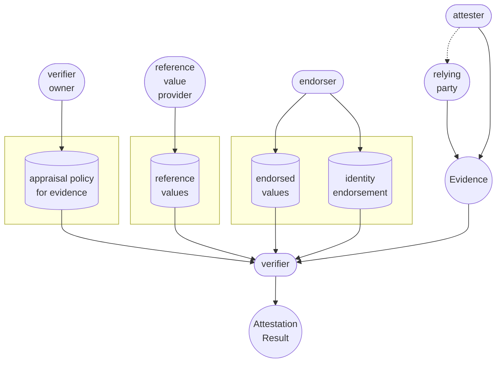
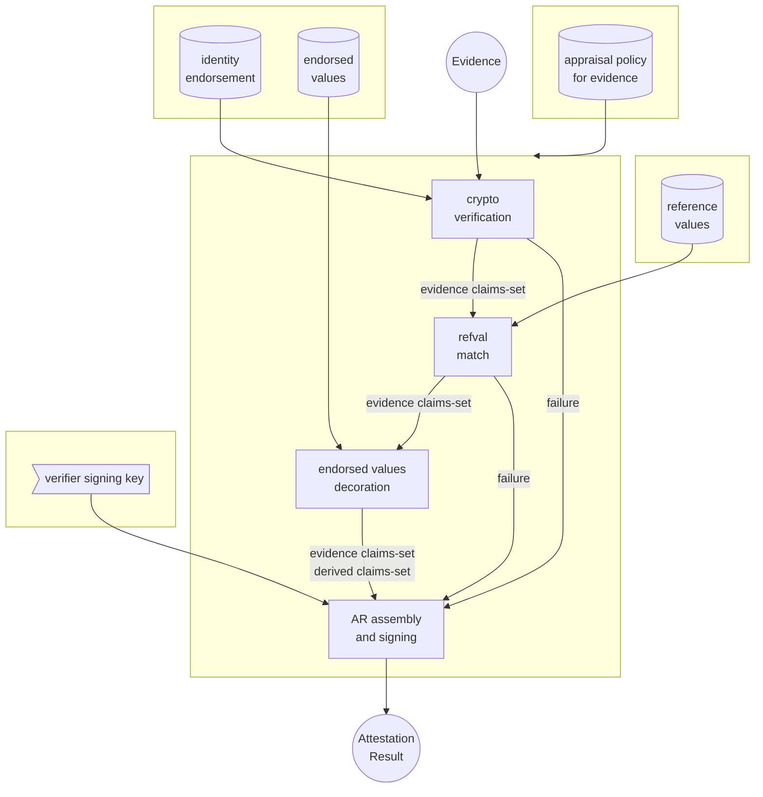
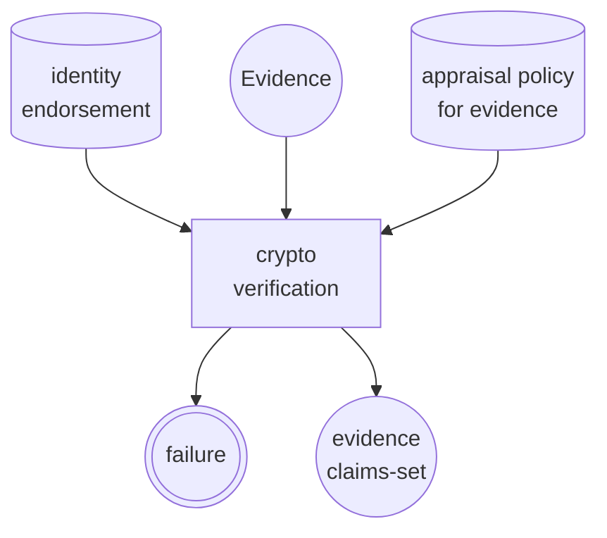
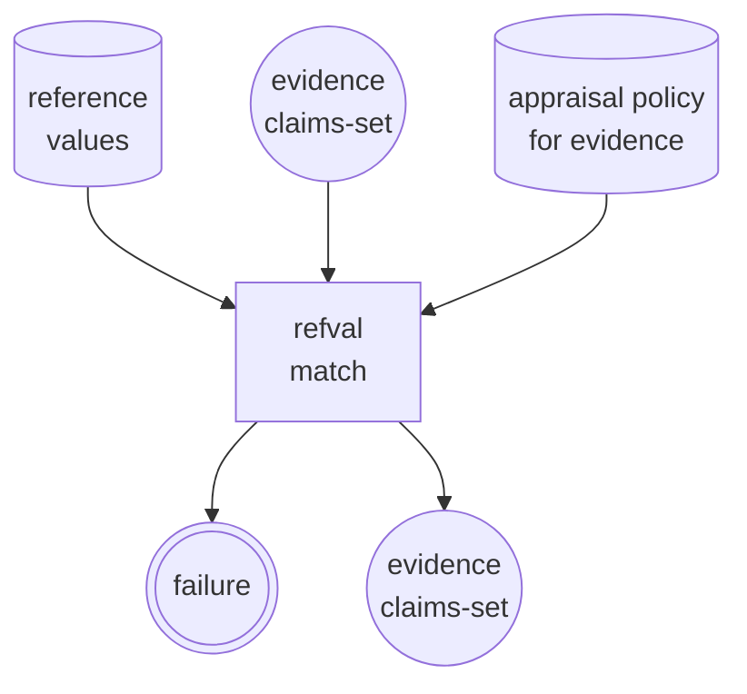
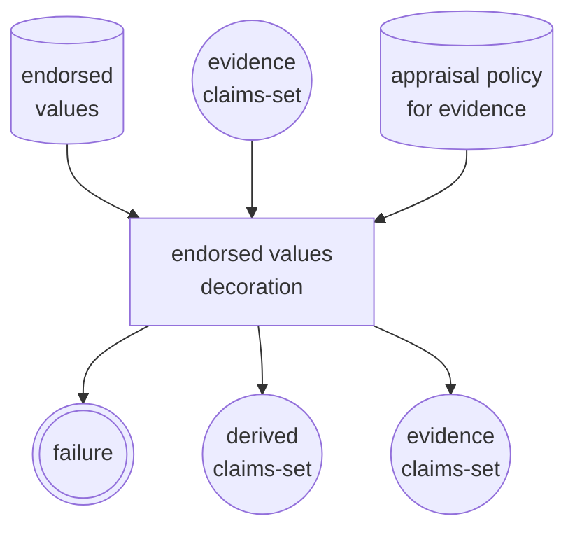
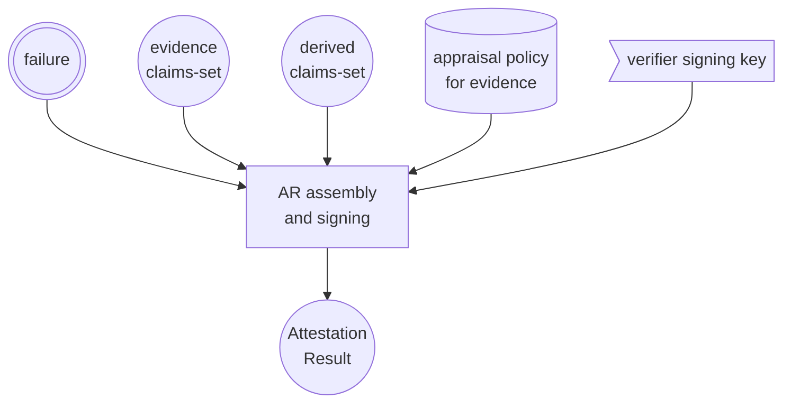

# Verification Machinery

## Verification From Ten Thousand Feet

The picture below is yet another way to slice the [RATS architecture](https://www.rfc-editor.org/rfc/rfc9334.html#figure-1), which makes the (important) distinction between _"identity endorsements"_ (e.g., verification keys), and _"endorsed values"_ (e.g., certification status of the gadget, color, etc.), which is not explicit in RFC9334.

This distinction becomes relevant when zooming in to the [appraisal process](#a-closer-look-to-the-appraisal-process) where one kind or the other is used depending on the verification "stage."

## A Closer Look to the Appraisal Process

The picture below provides a closer look in to the appraisal process, describing what a typical verification flow could look like.  The flow is broken down into four separate stages:

* [Crypto verification](#crypto-verification)
* [Reference values match](#reference-values-match)
* [Endorsed values decoration](#endorsed-values-decoration)
* [Attestation result assembly and signing](#attestation-result-assembly-and-signing)

> **Notes**:
>
> * The appraisal policy is an input to all the processing stages
> * All non-final processing stages can output a "failure" signal that short circuits the appraisal
  

### Crypto Verification

> Input:
>
> * Evidence to be verified
> * Identity endorsements

1. Look up the matching identity endorsement (e.g., a raw public key, a trust anchor, etc.)
1. Use the key material to verify the Evidence's cryptographic envelope

> Output:
>
> * the (cryptographically verified) Evidence's claims-set

### Reference Values match

> Input:
>
> * Evidence claims-set
> * Reference values

1. Look up any applicable reference values
1. Match reference values against the claims-set

> Output:
>
> * (validated) Evidence claims-set

### Endorsed Values Decoration

> Input:
>
> * The Evidence claims-set
> * Endorsed values

1. Look up applicable endorsed values
1. decide (based on policy) which endorsed values can be added to the claims-set

> Output:
>
> * Evidence claims-set
> * Derived claims-set

### Attestation Result assembly and signing

> Input:
>
> * Evidence and Derived claims-set, or a failure signal
> * the Verifier private key that signs the attestation result

1. Determine the attestation result claims-set based on the input claims-set and policy
1. Sign the final attestation result statement

> Output:
>
> * Signed attestation results

