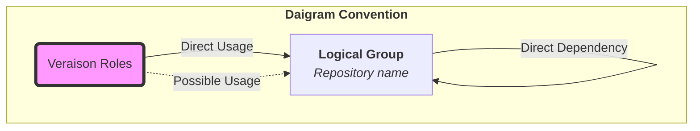
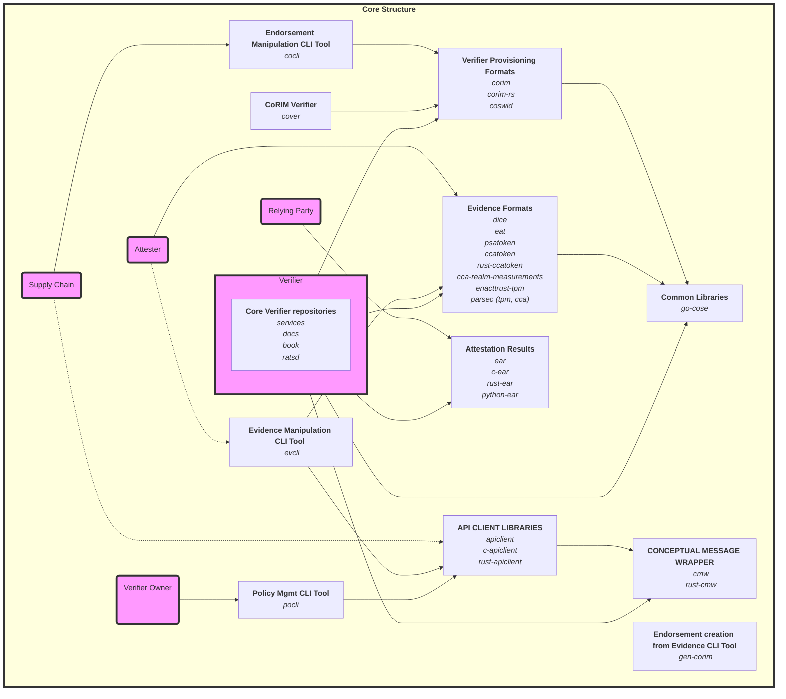
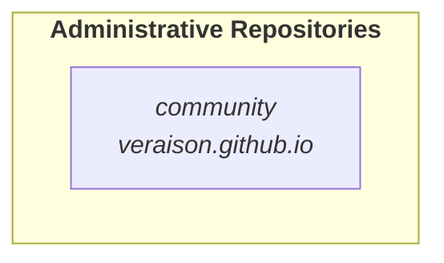

# Repo Guide

The following is a quick overview of the Veraison repos. This is a selective list to help get started navigating the work under the Project Veraison organisation. For a full list of repos, see: https://github.com/orgs/veraison/repositories?type=all

Unless specified, code repos are Golang based

## Core Code

[services](https://github.com/veraison/services)
This is the main repo holding the code implementing the attestation verification components that can be used to create a service. 

[docs](https://github.com/veraison/docs)
Veraison documentation

[book](https://github.com/veraison/book)
Compilation of documentation for various Veraison projects into a reader-friendly format

## Project 
[community](https://github.com/veraison/community)
Veraison community files. Look here for introductory presentations to the project and CCC membership materials.

[veraison.github.io](https://github.com/veraison/veraison.github.io) 
Currently a placeholder for veraison-project.org.

## Client Libraries
Veraison services expose REST APIs. This set of libraries provides convenient code abstractions for the API model, to be used in client verification and provisioning applications.

[apiclient](https://github.com/veraison/apiclient): Veraison API client implementation in Go
[rust-apiclient](https://github.com/veraison/rust-apiclient): Veraison API client implementation in Rust
[c-apiclient](https://github.com/veraison/c-apiclient): Veraison API client implementation in C

## Architecture specific libs
This collection of libraries provides manipulation and verification functionality for Attestation formats of various architectures. 

[psatoken](https://github.com/veraison/psatoken): Platform Security Abstraction (PSA) Attestation Token manipulation library.

[ccatoken](https://github.com/veraison/ccatoken) 
A library for the Arm Confidential Computing Architecture (CCA) Attestation Token.

[rust-ccatoken](https://github.com/veraison/rust-ccatoken)
Rust implementation of the Arm Confidential Computing Architecture (CCA) Attestation Token library.

[cca-realm-measurements](https://github.com/veraison/cca-realm-measurements)
Library for handling CCA Realm measurements and attestation data.

[dice](https://github.com/veraison/dice): library providing support functions for manipulating various profiles of DICE.

[parsec](https://github.com/veraison/parsec): Library support for handling the Parsec Key Attestation formats used in the attested TLS PoC.

## Demos and Integration Examples

[enact-demo](https://github.com/veraison/enact-demo): EnactTrust TPM/Veraison interop demo and related docs

[keybroker-demo](https://github.com/veraison/keybroker-demo): A simple key broker protocol demonstration

## CLI tools 
CLI tools for illustrative interactions with attestation tokens or a Veraison service. Used for demos & integration testing.

[evcli](https://github.com/veraison/evcli)
CLI for handling attestation evidence

[pocli](https://github.com/veraison/pocli) 
CLI for Veraison services policy management client

[gen-corim](https://github.com/veraison/gen-corim)
CLI for generating CoRIM (containing Endorsements and Reference Values) using Evidence

[gen-testcase](https://github.com/veraison/gen-testcase)
Test case generator for CoRIM-related testing and validation

[cover](https://github.com/veraison/cover)
CoRIM Verifier - tool for verifying CoRIM files

## Standards driven work
The Veraison Project supports Attestation related working groups in standards bodies, in particular IETF & TCG. This set of repos provide test bed implementations for some of the standards work, as related to Veraison services.

#### EAT
[eat](https://github.com/veraison/eat) 
Golang library for manipulating Entity Attestation Tokens (draft-ietf-rats-eat).

#### EAR
These libraries provide functions for working with EAR (EAT Attestation Results), an EAT/JWT serialisation of the Attestation Result for Secure Interactions (AR4SI) information model - see draft-fv-rats-ear

[ear](https://github.com/veraison/ear): Golang implementation of EAT Attestation Results
[rust-ear](https://github.com/veraison/rust-ear): Rust implementation of EAT Attestation Results
[c-ear](https://github.com/veraison/c-ear): C implementation of EAT Attestation Results
[python-ear](https://github.com/veraison/python-ear): Python implementation of EAT Attestation Results
 
[cmw](https://github.com/veraison/cmw): implementation for  RATS WG Conceptual Message Wrappers (draft-ftbs-rats-msg-wrap) for attestation related data encapsulation.

[rust-cmw](https://github.com/veraison/rust-cmw): Rust implementation of RATS WG Conceptual Message Wrappers

[ratsd](https://github.com/veraison/ratsd): A RATS conceptual message collection daemon

####  Verifier Provisioning 
These libraries provide support for the standard information models used to convey data to a Verifier.

[corim](https://github.com/veraison/corim): manipulation of Concise Reference Integrity Manifest (CoRIM) and Concise Module Identifier (CoMID) tags. Also includes cocli CLI tool, that assists users creating CoRIM & CoMID tags.

[corim-rs](https://github.com/veraison/corim-rs): Rust implementation of CoRIM and CoMID manipulation library

[swid](https://github.com/veraison/swid) : SWID and CoSWID manipulation library

#### COSE
[go-cose](https://github.com/veraison/go-cose): go library for CBOR Object Signing and Encryption (COSE)

## Veraison Repository Organisation

